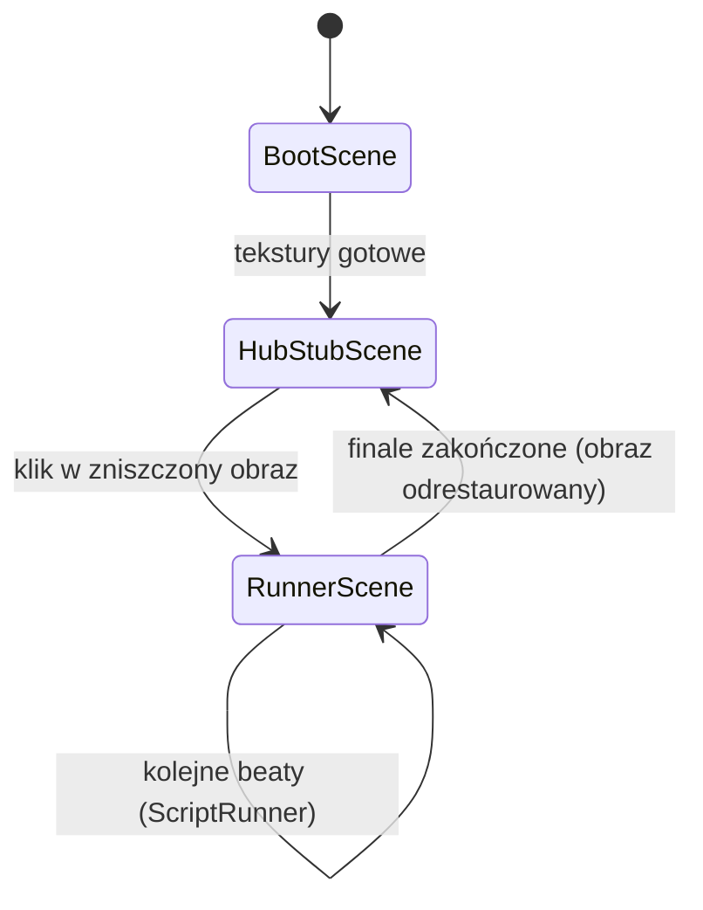

# 02 — Architektura techniczna

Ten dokument opisuje, JAK zbudowany jest silnik. Jest wiążący dla Etapów 0–5 (patrz `03_PLAN_ETAPOW.md`). Wszystkie decyzje są zgodne ze stackiem i zasadami opisanymi w `CLAUDE.md`. Jeśli coś w tym pliku koliduje z `CLAUDE.md` — obowiązuje `CLAUDE.md`.

## 1. Struktura repozytorium

```
portfolio-runner/
  src/
    main.ts                    punkt wejścia — tworzy grę Phasera, montuje overlay DOM
    config/
      gameConfig.ts             obiekt Phaser.Types.Core.GameConfig (rozmiar, physics, scale)
      palette.ts                stałe kolorów z docs/04_STYL_I_ASSETY.md (hex + Phaser number)
    scenes/
      BootScene.ts               generuje tekstury placeholder, ładuje manifest, przechodzi dalej
      HubStubScene.ts             jedna ściana z zniszczonym/odrestaurowanym obrazem, klik = start
      RunnerScene.ts               pętla biegu: paralaksa, gracz, przeszkody, emisja zdarzeń do UI
    script/
      ScriptRunner.ts             maszyna stanów beatów — czysta logika, bez zależności od Phasera
      types.ts                    typy Case/Beat/Option zgodne z content/schema/case.schema.json
    ui/
      DialoguePanel.ts             komponent DOM: narracja, wybory, timer, widgety, wyniki, finał
      widgets/
        ButtonWidget.ts            widget "zrzutka" — licznik animowany do wartości docelowej
        PuzzleWidget.ts            układanka kafli (klik zamienia dwa kafle)
        RevealWidget.ts            fade to black i z powrotem ("zamknij oczy")
      typewriter.ts                efekt maszyny do pisania dla tekstu narracji
    runner/
      Player.ts                    sprite gracza: run/jump/stumble, Arcade Physics
      Parallax.ts                  3-4 warstwy tileSprite, setSpeedMultiplier(time dilation)
      Obstacles.ts                 ObstacleSpawner — pula obiektów, spawnForBeat(beat, arriveInMs)
      TimeDilation.ts              spowolnienie czasu gry (0.35x) na czas wyboru/QTE
    state/
      GameState.ts                 fragments[], skills{}, stumbles, elapsedMs — tylko w pamięci
    content/
      loader.ts                    fetch + walidacja JSON (zod) wg schematu
      obstacles.ts                 słownik: klucz przeszkody -> etykieta + placeholder graficzny
    assets/
      manifest.ts                  klucz -> ścieżka -> licencja (pojedyncze źródło prawdy o assetach)
    events/
      bus.ts                       jeden EventEmitter współdzielony Phaser <-> DOM
  content/
    schema/case.schema.json        formalna schema JSON case'a (patrz docs/01_GDD_RUNNER_POC.md sekcja d)
    cases/teatr-jest-nasz.json     pilot
    cases/_demo.json               skrypt testowy 6-beatowy (Etap 2)
  public/
    assets/placeholders/           nic tu nie ma na starcie — generowane kodem w BootScene
    assets/cc0/                    pobrane paczki CC0 (Kenney itd.)
    assets/paintings/              obrazy case'ów (placeholder SVG/PNG w PoC)
  docs/
    screens/                       zrzuty ekranu z Playwright (dowód dla Arka)
  tests/
    unit/                          Vitest
    e2e/                           Playwright
  .github/workflows/deploy.yml     build + testy + deploy na GitHub Pages
  vite.config.ts
  tsconfig.json
  ASSETS_ATTRIBUTION.md            lista assetów CC0 z linkami i licencjami
  docs/DZIENNIK.md                 log decyzji i nowych zależności
```

## 2. Sceny Phasera i przepływ



Uwaga: Results i Finale w PoC są beatami renderowanymi przez `DialoguePanel` (overlay DOM), nie osobnymi scenami Phasera — silnik gry (bieg) w tle albo jest wstrzymany, albo dobiega w zwolnionym tempie. Osobne sceny `ResultsScene`/`FinaleScene` zostają w backlogu, gdyby DOM-owy wariant okazał się niewystarczający wizualnie (patrz `06_BACKLOG_PO_POC.md`).

## 3. Moduły TS — odpowiedzialności i publiczne API

### `script/ScriptRunner.ts`
Maszyna stanów, która zna sekwencję beatów case'a i nic więcej — nie wie nic o Phaserze ani o DOM.

```ts
class ScriptRunner extends EventEmitter {
  load(kejs: Case): void
  start(): void
  resolveChoice(indexOpcji: number): void
  triggerAction(): void          // wywoływane przez input gracza (skok) w oknie QTE

  // zdarzenia:
  // 'beat:start'      -> (beat: Beat)
  // 'beat:resolved'    -> (beat: Beat, wynik: { trafne: boolean })
  // 'fragment:collected' -> (numerFragmentu: number)
  // 'case:finished'     -> ()
}
```

### `ui/DialoguePanel.ts`
Komponent DOM (nie Phaser) renderujący aktualny beat i przyjmujący input użytkownika.

```ts
class DialoguePanel {
  showNarration(tekst: string, tryb: 'tap' | 'auto', czasMs?: number): void
  showChoice(prompt: string, opcje: Opcja[], timerMs: number): void
  showAction(prompt: string, oknoMs: number): void
  showWidget(widget: WidgetConfig): void
  showResults(staty: StatDelta[], kpi: Kpi[]): void
  showFinale(tekst: string, cta: Cta): void
}
```

### `runner/Player.ts`
```ts
class Player {
  run(): void
  jump(): void
  stumble(): void
}
```

### `runner/Obstacles.ts`
```ts
class ObstacleSpawner {
  spawnForBeat(beat: Beat, arriveInMs: number): void
}
```

### `runner/Parallax.ts`
```ts
class Parallax {
  setSpeedMultiplier(mnoznik: number): void   // np. 0.35 na czas wyboru
}
```

Pełne sygnatury (parametry pomocnicze, typy zwracane) doprecyzowuje się w Etapie 1–2 w kodzie — powyższe API jest kontraktem minimalnym i nie wolno go zawężać bez wpisu w `docs/DZIENNIK.md`.

## 4. Komunikacja Phaser <-> DOM

Jeden wspólny `EventEmitter` (`src/events/bus.ts`), bez bezpośrednich referencji z kodu DOM do obiektów sceny Phasera i odwrotnie. `RunnerScene` emituje `beat:start` itd. (przez `ScriptRunner`), `DialoguePanel` nasłuchuje i renderuje; input z `DialoguePanel` (wybór opcji, klik widgetu) woła metody `ScriptRunner` (`resolveChoice`, `triggerAction`). Żaden moduł UI nie importuje klas scen Phasera; żadna scena nie importuje `DialoguePanel` bezpośrednio — tylko emituje/nasłuchuje zdarzenia z magistrali.

## 5. Stan gry

`state/GameState.ts` — obiekt trzymany tylko w pamięci (żadnego `localStorage` w PoC, zgodnie z ADR-4 niżej):

```ts
interface GameState {
  fragments: number[];        // zebrane numery fragmentów obrazu
  skills: Record<string, number>; // suma przyrostów per skill
  stumbles: number;           // licznik potknięć
  elapsedMs: number;          // czas od startu case'a
}
```

## 6. Ładowanie i walidacja JSON

Rekomendacja: **zod**, nie ajv. Uzasadnienie: zod jest TS-first — schema zod generuje jednocześnie typ TS (`z.infer<typeof CaseSchema>`), więc nie utrzymujemy osobno interfejsu i walidatora; ajv jest szybszy przy dużej skali, ale tu mamy pojedyncze pliki JSON ładowane raz na wejście do case'a — wydajność nie jest czynnikiem. `content/schema/case.schema.json` zostaje jako dokumentacja formatu (czytelna dla osób nietechnicznych/dla innych narzędzi) i jako punkt odniesienia w teście zgodności (Vitest sprawdza, że schema zod i schema JSON opisują te same pola — test ręczny na próbce, nie automatyczna konwersja).

```ts
// content/loader.ts
function loadCase(json: unknown): Case   // rzuca z czytelnym błędem przy niezgodności
```

## 7. Manifest assetów

`src/assets/manifest.ts` — jedyne miejsce mapujące klucz logiczny na plik i licencję:

```ts
export const ASSET_MANIFEST = {
  'player.run': { path: 'cc0/kenney-pixel-platformer/run.png', license: 'CC0 — Kenney' },
  'bg.layer1':  { path: 'placeholders/generated', license: 'wygenerowane kodem' },
  // ...
} as const;
```

Podmiana placeholdera na finalny asset = zmiana jednej ścieżki w tym pliku, zero zmian w kodzie scen.

## 8. Generowanie placeholderów w BootScene

`Phaser.GameObjects.Graphics` rysuje prostokąty/sylwetki/gradienty w palecie (`docs/04_STYL_I_ASSETY.md`), następnie `generateTexture(klucz, szerokosc, wysokosc)` zapisuje to jako teksturę do dalszego użycia przez sprite'y — bez plików graficznych na dysku. Używane dla wszystkiego, co nie ma jeszcze odpowiednika CC0 (gracz, przeszkody, tło obrazu do ułożenia).

## 9. Konfiguracja Phasera

```ts
{
  type: Phaser.AUTO,
  pixelArt: true,
  scale: { mode: Phaser.Scale.FIT, autoCenter: Phaser.Scale.CENTER_BOTH },
  physics: { default: 'arcade', arcade: { gravity: { y: 900 }, debug: false } },
  fps: { target: 60 },
}
```

## 10. Layout stack/side

CSS Grid dla kontenera całej gry. Domyślny layout to `stack` (canvas nad panelem, wiersze). Przełączanie odbywa się w **runtime**, parametrem URL `?layout=stack` lub `?layout=side`, odczytywanym w JS przy starcie gry — dzięki temu oba warianty są dostępne pod jednym linkiem podglądu, bez nowego builda, i Arek może je porównać sam. Zmienna budowy `VITE_LAYOUT=stack|side` (build-time, przez Vite) ustawia wyłącznie wartość **domyślną**, gdy URL nie zawiera parametru `layout`. `stack`: canvas nad panelem (wiersze); `side`: panel obok canvasu (kolumny). Canvas siedzi w kontenerze o ustalonych proporcjach (np. `aspect-ratio: 16/9`), Phaser Scale Manager (FIT) dopasowuje się do tego kontenera, nie do całego okna.

## 11. Responsywność i resize

Nasłuch na `resize` woła `scale.refresh()` Phasera. Minimalna obsługiwana szerokość: 375 px — poniżej tego layout `stack` nadal działa (canvas i panel jeden pod drugim, oba się kurczą proporcjonalnie), `side` może być wyłączony poniżej pewnego breakpointu (decyzja wizualna do sprawdzenia w Etapie 2/4).

## 12. Dostępność

Panel dialogowy jako prawdziwy DOM (nie canvas) — czytelny dla czytników ekranu. Kontener tekstu narracji/wyborów ma `aria-live="polite"`. Fokus klawiatury przechodzi automatycznie na pierwszą opcję wyboru przy pojawieniu się beatu typu `choice`. `prefers-reduced-motion` wyłącza/skraca animacje (typewriter, fade, time dilation staje się natychmiastowe przejście zamiast płynnego zwolnienia). Kontrast tekstu w panelu ≥ 4.5:1 względem tła (sprawdzane Lighthouse w Etapie 4).

## 13. Testy

Vitest (`tests/unit/`): `ScriptRunner` uruchamiany na `_demo.json` i na `teatr-jest-nasz.json` — scenariusz "wszystkie wybory poprawne" (przejście do końca, komplet fragmentów) i scenariusz "część wyborów błędna" (potknięcia rosną, ale case i tak da się ukończyć — zgodnie z zasadą "nie da się przegrać historii").

Playwright (`tests/e2e/`): pełne przejście case'a przez faktyczne klikanie w przeglądarce (klik w obraz na hubie -> przejście wszystkich beatów -> finał -> powrót do huba z odrestaurowanym obrazem), ze zrzutami ekranu zapisywanymi do `docs/screens/` jako dowód wizualny dla Arka.

## 14. Build i deploy

`vite.config.ts`: `base: '/<nazwa-repo>/'` (wymagane przez GitHub Pages przy repo niebędącym `user.github.io`). `.github/workflows/deploy.yml`: on push do `main` -> `npm ci` -> `npm run build` -> `npm test` -> `npm run e2e` -> publikacja `dist/` na branch `gh-pages` (lub natywna akcja `actions/deploy-pages`).

Alternatywa Vercel: jeden akapit, bo to plan B, nie domyślna ścieżka — Vercel wykrywa Vite automatycznie (`vite build`, katalog wyjściowy `dist`), zero configu poza ewentualnym ustawieniem zmiennej `VITE_LAYOUT`; wybór między Pages a Vercel to kwestia tego, czy Arek chce darmowy branch GitHuba (Pages) czy wygodniejsze preview-URL per PR (Vercel) — do decyzji w Etapie 0, domyślnie Pages (patrz ADR-6 niżej).

## 15. Wydajność

`tileSprite` do przewijanych warstw tła (przesuwanie `tilePositionX`, nie tworzenie nowych obiektów). Object pooling przeszkód w `ObstacleSpawner` (reużywanie nieaktywnych instancji zamiast `destroy`/`new` w pętli `update`). Zasada: brak alokacji obiektów w `update()` scen (żadnych `new`, żadnych domknięć tworzonych co klatkę) — unikanie GC-pauz. Tekstury generowane i wczytywane ≤ 2048x2048 (limit bezpieczny dla starszych GPU/mobile).

## 16. Decyzje architektoniczne (ADR)

**ADR-1: Phaser 3 zamiast własnego silnika na czystym canvasie.**
Uzasadnienie: gotowa Arcade Physics, Scale Manager, system tekstur i tileSprite — oszczędza tygodnie pracy nad rzeczami niezwiązanymi z treścią (kolizje, skalowanie, zarządzanie assetami). Konsekwencja: zależność od API Phasera, krzywa uczenia dla przyszłych kontrybutorów nieznających frameworka.

**ADR-2: Panel dialogowy jako nakładka DOM, nie rysowanie w canvasie.**
Uzasadnienie: dostępność (czytniki ekranu, `aria-live`), zaznaczanie tekstu, natywna responsywność CSS, prostszy typewriter i formularze niż ręczne renderowanie tekstu w WebGL/Canvas. Konsekwencja: dwie warstwy do zsynchronizowania (Phaser + DOM) przez wspólny event bus; ryzyko rozjazdu wizualnego, jeśli style CSS i paleta Phasera nie są trzymane w jednym źródle (`palette.ts`).

**ADR-3: Beaty sterowane danymi (JSON), silnik nie zna treści.**
Uzasadnienie: zgodnie z zasadą "treść tylko w content/" (patrz `CLAUDE.md`) — dodanie nowego case'a nie wymaga zmian w kodzie, tylko nowego pliku JSON zgodnego ze schematem. Konsekwencja: silnik musi obsłużyć pełny zestaw typów beatów generycznie; każdy nowy typ beatu wymaga zmiany w `ScriptRunner` i `DialoguePanel`, więc typy beatów trzymamy zamknięte (nie dodajemy nowych bez decyzji architektonicznej).

**ADR-4: Brak `localStorage` w PoC.**
Uzasadnienie: na tym etapie nie ma wymogu zapisu postępu między sesjami (patrz `docs/01_GDD_RUNNER_POC.md` sekcja o pętli rozgrywki); upraszcza stan (`GameState` tylko w pamięci, resetuje się przy odświeżeniu). Konsekwencja: odświeżenie strony w trakcie case'a = utrata postępu; akceptowalne dla PoC, do rewizji w backlogu.

**ADR-5: Brak Reactu/frameworka UI — vanilla TS + mały system komponentów DOM.**
Uzasadnienie: patrz `CLAUDE.md`, sekcja „Stack i komendy" — panel dialogowy to kilka widoków (narracja, wybór, widget, wyniki, finał), nie uzasadnia narzutu frameworka SPA; unika też konfliktu "dwa reconciliery" (React + Phaser) o ten sam obszar ekranu. Konsekwencja: ręczne zarządzanie odłączaniem event listenerów przy zmianie widoku panelu — potencjalne wycieki pamięci, jeśli nie posprzątane starannie w `DialoguePanel`.

**ADR-6: GitHub Pages jako domyślny deploy podglądu.**
Uzasadnienie: darmowy, nie wymaga zakładania konta na dodatkowym serwisie przez Arka, prosta integracja z GitHub Actions już wymaganym do CI (testy). Konsekwencja: wymaga poprawnego `base` w `vite.config.ts` i świadomości ścieżek assetów względnych — częste źródło błędów 404 po deployu (patrz CLAUDE.md, sekcja "Pułapki").

**ADR-7: zod do walidacji contentu.**
Uzasadnienie: patrz sekcja 6 wyżej — jedno źródło prawdy dla typu TS i walidacji runtime. Konsekwencja: `content/schema/case.schema.json` (JSON Schema) i schema zod trzeba utrzymywać spójne ręcznie — bez automatycznej konwersji w PoC (odnotowane jako zadanie do backlogu, jeśli liczba case'ów urośnie).
